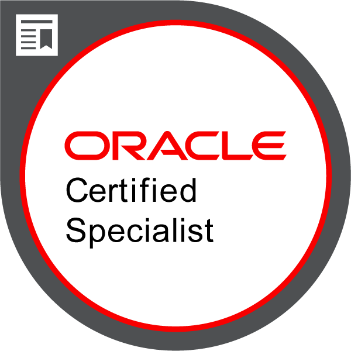
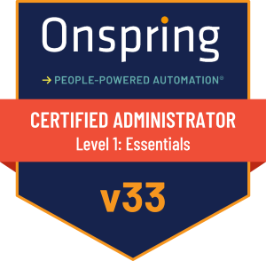

# 👋 Hi there, dium here!

## 🌱 About Me
- 🧑‍💻 Support Analyst casually learning web development by scratch
- 🚀 Currently learning: HTML, CSS, and JavaScript (a little bit of Github stuff too)
- 🛠️ Exploring the basics of coding, troubleshooting, and tech support

## 📚 My Learning Goals
- Build and deploy my first personal website
- Understand how to contribute to open source projects
- Learn best practices for troubleshooting and technical documentation

## 📫 How to Reach Me
- Email: parkdium@gmail.com
- 

## Badges:
 

---

_Thanks for stopping by my profile!_ ✨  
_Let’s connect and grow together!_
