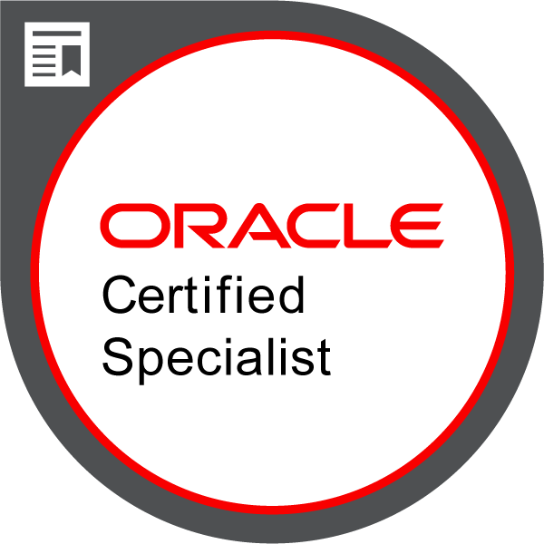
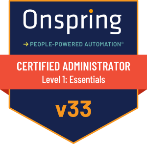

# 👋 Hi there, dium here!

## 🌱 About Me
- 🧑‍💻 Support Analyst casually learning web development by scratch
- 🚀 Currently learning: HTML, CSS, and JavaScript (a little bit of Github stuff too)
- 🛠️ Exploring the basics of coding, troubleshooting, and tech support

## 📚 My Learning Goals
- Build and deploy my first personal website
- Understand how to contribute to open source projects
- Learn best practices for troubleshooting and technical documentation

## 📖 My Progress
- The Odin Project `[██░░░░░░░░░░░░░░░░░░] 12%`
     - <a href="https://www.theodinproject.com/paths/foundations/courses/foundations">Foundations Course</a>
          - <a href="https://www.theodinproject.com/lessons/foundations-how-does-the-web-work">Prerequisites - How Does the Web Work?</a>

## Badges:
 

## 📫 Contact me here
- Email: parkdium@gmail.com
- You can also dm me on my socials <a href="https://bento.me/dium">here</a>!
  
---

_Thanks for stopping by!_ ✨  
_Let’s connect and grow together!_
